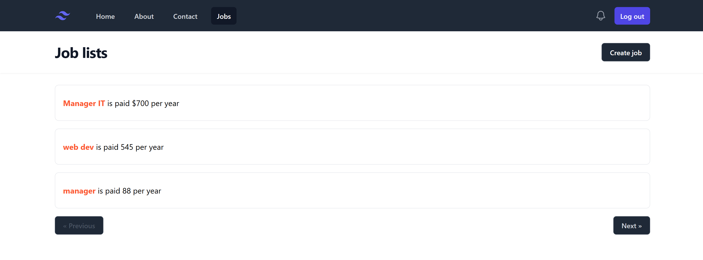

Joblisting Laravel Project

A simple job listing web application built with Laravel as part of an online tutorial.
This project helps students learn Laravel fundamentals such as routes, controllers, models, views, migrations, and basic CRUD operations.

🧠 Overview

This project is a job listing platform where users can view job posts, search for jobs, and add edit, or delete listings.
It focuses on teaching core Laravel concepts through a real application example.

🚀 Features

✔ Laravel MVC architecture
✔ Job listing CRUD (Create, Read, Update, Delete)
✔ Database migrations & models
✔ Blade templates for UI
✔ Basic search/filtering functionality

🛠️ Getting Started

Follow these steps to run the project locally:

1. Clone the repository
   git clone https://github.com/SousdeyKim/Joblisting-laravel-project.git
   cd Joblisting-laravel-project
2. Install dependencies
   composer install
   npm install
3. Environment setup

    Copy .env.example to .env:

    cp .env.example .env

    Generate an application key:

    php artisan key:generate

    Update your .env file with your database settings.

    If you use SQLite instead of MySQL, you can create a database file:

    touch database/database.sqlite

    Then set:

    DB_CONNECTION=sqlite
    DB_DATABASE=/absolute/path/to/database/database.sqlite 

4. Run migrations
php artisan migrate

(Optional) Seed the database if you added seeders:

php artisan db:seed 5. Run the development servers

Start the Laravel backend:

php artisan serve

(Optional) Build frontend assets:

npm run dev

Then open:

http://127.0.0.1:8000

🧩 Project Structure

Typical Laravel folders:

  app/ — Application logic

  database/ — Migrations & seeders

  resources/views/ — Blade templates

  routes/web.php — Web routes
  
  public/ — Public files
